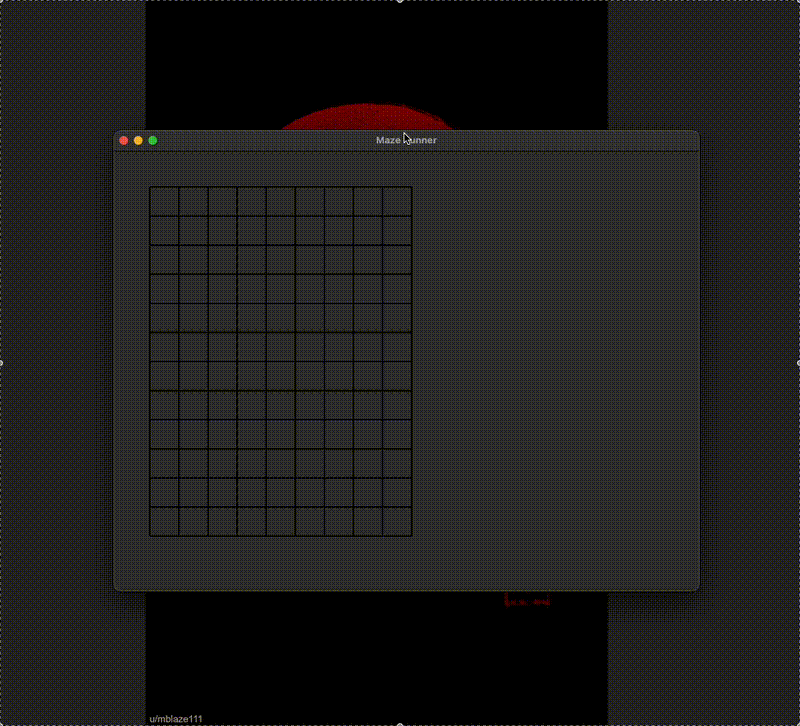

# Maze Runner

A Python application that generates and solves mazes using depth-first search algorithms. Watch as the maze is created and then solved in real-time with a visual representation of the solving process.



## Features

- Dynamic maze generation using depth-first search
- Visual representation of maze creation
- Interactive maze solving with backtracking visualization
- Configurable maze size and cell dimensions
- Reproducible maze patterns using random seeds
- Animated solving process showing exploration and backtracking

## Requirements

- Python 3.x
- Tkinter (usually comes with Python)

## Installation

1. Clone this repository:
```bash
git clone https://github.com/yourusername/Maze-Runner.git
cd Maze-Runner
```

2. No additional dependencies needed! The application uses only Python's standard library.

## Usage

Run the main application:
```bash
python main.py
```

This will:
1. Create a window with a 12x12 maze
2. Generate the maze using a depth-first search algorithm
3. Solve the maze, showing the exploration process
4. Display the solution path from start to finish

## Code Structure

- `main.py` - Entry point and window creation
- `maze.py` - Maze class with generation and solving algorithms
- `cell.py` - Cell class representing individual maze cells
- `window.py` - Window management and drawing utilities
- `tests.py` - Unit tests for maze functionality

## How It Works

### Maze Generation
- Uses depth-first search with recursive backtracking
- Starts from the top-left cell
- Randomly breaks walls between cells
- Ensures all cells are reachable
- Creates entrance at top-left and exit at bottom-right

### Maze Solving
- Implements depth-first search algorithm
- Visualizes the exploration process in red
- Shows backtracking in gray
- Marks the final solution path
- Guarantees finding a solution if one exists

## Testing

Run the test suite:
```bash
python tests.py
```

Tests cover:
- Maze creation and initialization
- Wall breaking and cell connectivity
- Entrance and exit creation
- Maze solving functionality
- Visited cell tracking

## Customization

Modify `main.py` to customize:
- Maze dimensions (rows and columns)
- Cell size
- Animation speed
- Window size
- Random seed for reproducible patterns

Example:
```python
# Create a larger maze with smaller cells
maze = Maze(50, 50, 20, 20, 30, 30, win, seed=42)
```

## Contributing

1. Fork the repository
2. Create a feature branch
3. Commit your changes
4. Push to the branch
5. Create a Pull Request

## License

This project is licensed under the MIT License - see the LICENSE file for details.
